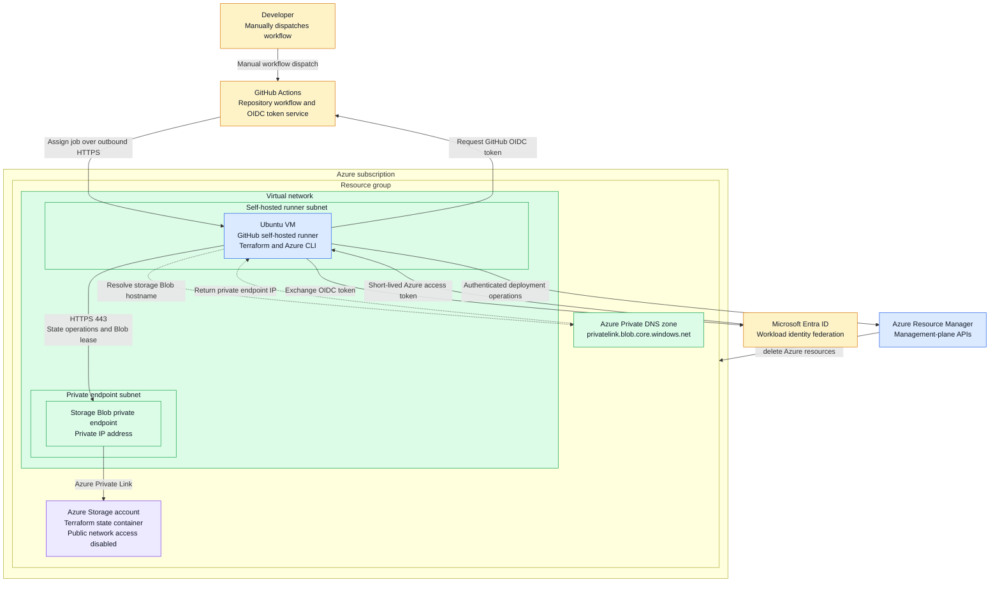

# Self-hosted runner and private Terraform backend architecture

This architecture allows GitHub Actions to run Terraform against an Azure Storage backend that has public network access disabled. A self-hosted Ubuntu runner and the Blob private endpoint are deployed in separate subnets of the same virtual network and resource group.

The storage account is in the same resource group, but it is not deployed inside the virtual network. Its Blob service is exposed privately to the virtual network through the private endpoint.

## Architecture diagram



## Component placement

| Component | Placement | Purpose |
| --- | --- | --- |
| Self-hosted runner VM | Dedicated subnet in the virtual network | Receives GitHub Actions jobs and runs Terraform and Azure CLI commands. |
| Blob private endpoint | Separate private-endpoint subnet in the same virtual network | Gives the storage Blob service a private IP reachable from the runner. |
| Azure Storage account | Same resource group, outside the virtual network boundary | Stores Terraform state in a private Blob container. |
| Private DNS zone | Linked to the virtual network | Resolves the normal storage Blob hostname to the private endpoint IP. |
| Microsoft Entra application or managed identity | Microsoft Entra tenant | Trusts GitHub's OIDC issuer and authorizes the workflow without a client secret. |

## Workflow and authentication flow

1. A developer manually starts the GitHub Actions workflow.
2. The self-hosted runner maintains an outbound HTTPS connection to GitHub and accepts the job.
3. GitHub issues a short-lived OIDC token for the workflow run.
4. Microsoft Entra ID validates the token against the configured federated identity credential.
5. Microsoft Entra ID returns a short-lived Azure access token to the workflow.
6. Terraform uses the token for Azure Resource Manager deployment operations.
7. Terraform also uses Microsoft Entra authorization to access the state container. The identity requires `Storage Blob Data Contributor` at the container or storage-account scope.
8. No Azure client secret or storage account key is required by the workflow.

The federated credential subject must match the workflow context. Because the current test runs from the `main` branch without a GitHub environment, its subject is:

```text
repo:<organization>/<repository>:ref:refs/heads/main
```

## Private state access flow

1. Terraform requests `<storage-account>.blob.core.windows.net`.
2. Private DNS follows the Azure Private Link alias and returns the private endpoint's IP address.
3. The runner connects to that address over HTTPS port 443 within the virtual network.
4. The private endpoint carries the request to the storage account's Blob service through Azure Private Link.
5. Terraform reads and writes the state blob and uses an Azure Blob lease for state locking.
6. The storage account rejects access through its public network endpoint because public network access is disabled.

## Network requirements

The runner subnet must permit:

- DNS queries to the approved Azure or custom DNS resolver;
- HTTPS port 443 to the storage private endpoint;
- outbound HTTPS to required GitHub Actions endpoints;
- outbound HTTPS to Microsoft Entra ID; and
- outbound HTTPS to Azure Resource Manager and any Azure service APIs used by the deployment.

The private DNS zone `privatelink.blob.core.windows.net` must be linked to the runner virtual network. If the virtual network uses custom DNS servers, configure conditional forwarding for the private-link zone to a resolver that can resolve Azure Private DNS.

## Security properties

- Terraform state is not exposed through the storage account's public network endpoint.
- State traffic remains on the private network path through Azure Private Link.
- The runner and private endpoint are isolated in separate subnets.
- OIDC provides short-lived credentials, avoiding stored Azure client secrets.
- Azure RBAC controls both deployment permissions and Blob data access.
- Terraform state locking uses Azure Blob leases to protect against concurrent writes.
- GitHub workflow permissions grant `id-token: write` only so the job can request its OIDC token.

## Operational verification

From the Ubuntu runner, confirm that the storage hostname resolves to an RFC 1918 private address:

```bash
getent hosts <storage-account>.blob.core.windows.net
```

Confirm TCP and TLS connectivity:

```bash
curl -I https://<storage-account>.blob.core.windows.net/
```

An Azure HTTP response such as `400` or `403` proves that DNS, routing, TCP, and TLS connectivity work. Terraform backend initialization subsequently verifies Microsoft Entra authentication and Blob authorization.
